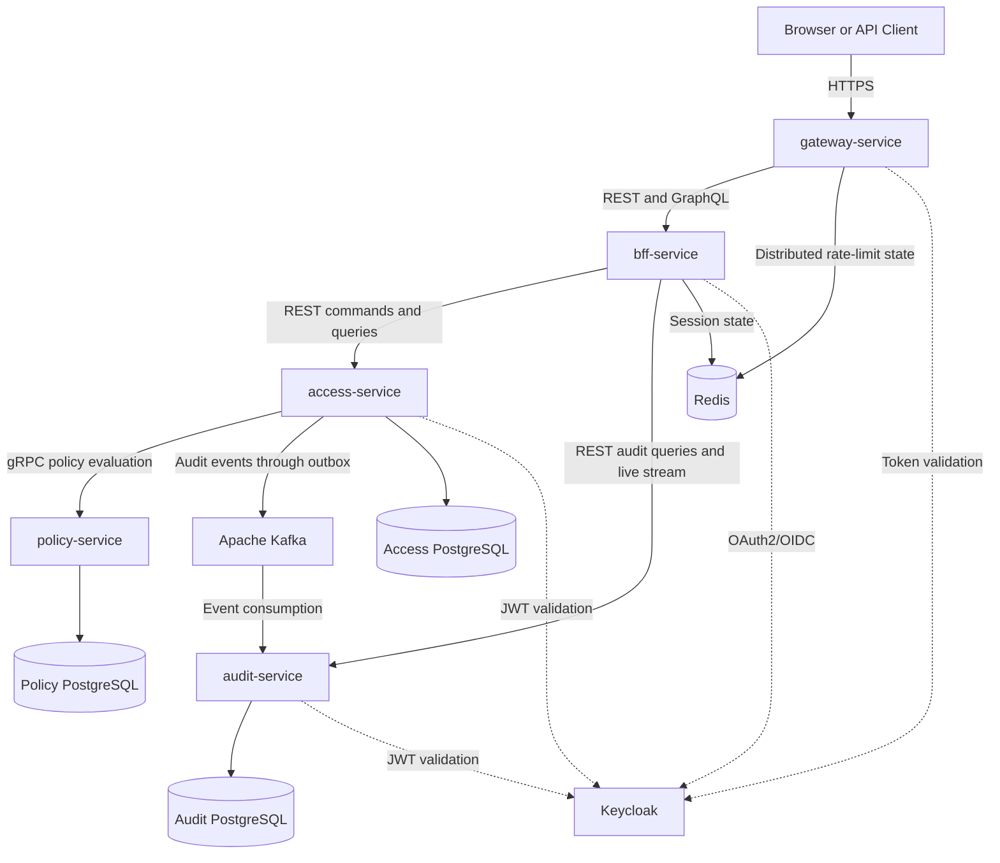

# Container View

## Overview

The platform consists of five independently deployable Java services supported by identity, messaging, persistence, rate-limiting, and observability infrastructure.

Each integration protocol has a specific architectural role:

- REST for commands and conventional service APIs;
- GraphQL for client-oriented queries and aggregated views;
- gRPC for synchronous internal policy decisions;
- Kafka for durable asynchronous audit event delivery.

## Container Diagram

## Service Responsibilities

### gateway-service

The gateway is the single public entry point.

Responsibilities:

- request routing;
- correlation and trace-context initialization;
- security headers;
- request size and timeout limits;
- distributed rate limiting;
- safe access logging;
- edge-level token validation.

The gateway is not the final authorization boundary. Downstream services enforce their own access rules.

### bff-service

The Backend for Frontend provides a client-oriented interface.

Responsibilities:

- OAuth2 Authorization Code login;
- secure server-side session handling;
- CSRF protection;
- browser-facing REST command façade;
- GraphQL queries and subscriptions;
- response aggregation;
- downstream token handling;
- resolver and field-level authorization.

The BFF does not own business data.

### access-service

The access service owns the main business workflow.

Responsibilities:

- user profile references;
- target application catalog;
- business entitlements;
- access requests;
- approval workflows;
- access assignments;
- provisioning and revocation;
- assignment expiration;
- policy-service orchestration;
- transactional outbox.

The service uses a transactional Spring MVC and JPA model. Reactive types are not placed around blocking persistence operations.

### policy-service

The policy service is the Policy Decision Point for domain authorization rules.

Responsibilities:

- Separation of Duties evaluation;
- risk classification;
- duration restrictions;
- approval-plan construction;
- versioned policy rules;
- structured decision evidence.

The policy service does not read the access-service database. The access service provides a trusted and explicitly structured evaluation context.

### audit-service

The audit service maintains security evidence.

Responsibilities:

- Kafka event consumption;
- event schema validation;
- duplicate detection;
- append-only audit persistence;
- tamper-evident hash chains;
- authorized audit search;
- audit-chain verification;
- retry and dead-letter handling;
- live audit-event streaming.

## Infrastructure Components

### Keycloak

Keycloak owns credentials, authentication sessions, service identities, and platform roles.

Business entitlements remain application domain data and are not represented as Keycloak realm roles.

### Apache Kafka

Kafka transports versioned audit and security events from producing services to independent consumers.

The delivery model is at least once. Consumers must therefore be idempotent.

### PostgreSQL

Each stateful service owns an independent database:

- access-service owns access workflow data;
- policy-service owns policy definitions and evaluations;
- audit-service owns audit evidence and deduplication state.

A service never reads another service's database.

### Redis

Redis stores distributed gateway rate-limit state and may store BFF sessions.

Redis does not contain authoritative business data.

## Communication Matrix

| Source | Target | Protocol | Purpose |
|---|---|---|---|
| Client | gateway-service | HTTPS | Public platform access |
| gateway-service | bff-service | REST and GraphQL | Client requests |
| bff-service | access-service | REST | Commands and access views |
| bff-service | audit-service | REST and streaming HTTP | Audit queries and live events |
| access-service | policy-service | gRPC | Policy evaluation |
| access-service | Kafka | Kafka producer | Reliable audit event publication |
| Kafka | audit-service | Kafka consumer | Audit event delivery |
| Services | Keycloak | OAuth2/OIDC | Login, token validation, and service identity |

## Architectural Boundaries

- Authentication belongs to Keycloak.
- Platform authorization is enforced by Spring Security.
- Business entitlement rules belong to the application domain.
- Policy evaluation belongs to policy-service.
- Access workflow state belongs to access-service.
- Audit evidence belongs to audit-service.
- Client aggregation belongs to bff-service.
- Edge traffic controls belong to gateway-service.