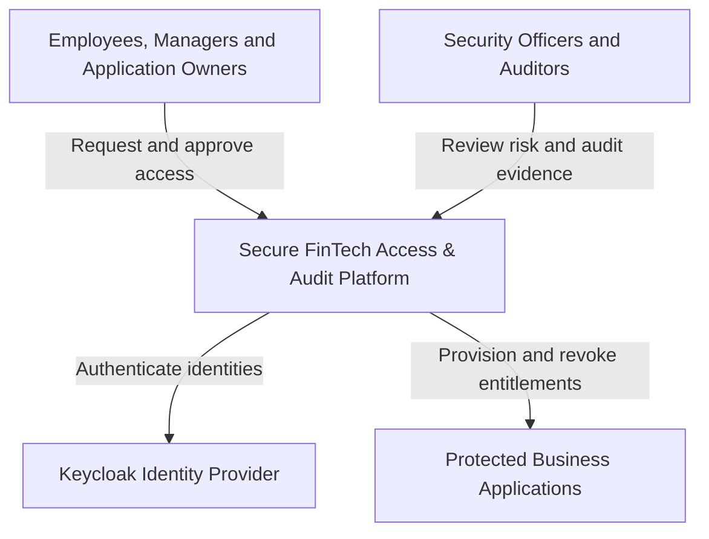

# System Context

## Purpose

The Secure FinTech Access & Audit Platform manages business entitlement requests, risk-based policy decisions, approval workflows, time-bound access assignments, and tamper-evident security audit records.

The platform is designed for a fictional regulated financial organization. It demonstrates secure enterprise backend architecture without processing real financial transactions or storing user credentials.

## System Context Diagram

## Primary Users

### Employee

Requests permitted business entitlements and views personal requests and assignments.

### Manager

Requests access for direct reports and performs manager approval when required.

### Application Owner

Approves access to applications or entitlements under their responsibility.

### Security Officer

Reviews privileged and high-risk access requests and investigates policy violations.

### Auditor

Searches audit evidence and verifies the integrity of recorded security events without changing business data.

### Platform Administrator

Manages the entitlement catalog and platform configuration. Administrative access does not override approval or Separation of Duties rules.

## External Systems

### Keycloak

Keycloak is responsible for authentication, OAuth2/OIDC flows, identity sessions, service identities, and platform roles.

The platform does not store passwords or implement its own identity provider.

### Protected Business Applications

The platform simulates provisioning and revocation of entitlements in fictional financial applications:

- `PAYMENTS_CORE`;
- `CUSTOMER_DATA`;
- `TREASURY`.

Real banking systems are outside the project scope.

## System Boundary

The platform is responsible for:

- entitlement catalog management;
- access request workflows;
- policy evaluation;
- risk-based approvals;
- assignment provisioning and revocation;
- reliable audit event delivery;
- tamper-evident audit storage;
- authorized audit investigation.

The platform is not responsible for:

- user credential storage;
- real financial transaction processing;
- production HR data;
- legal or regulatory certification;
- permanent operation of paid cloud infrastructure.